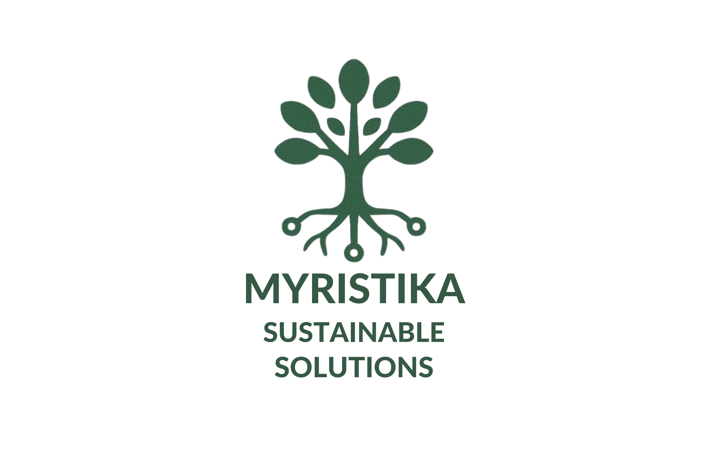

<div align="center">
  
  <h1>Myristika Sustainable Solutions – Official Website</h1>
  <p>Designed and developed as the digital face of Myristika Sustainable Solutions</p>
</div>

---

## 🌿 Overview

This is the official website of **Myristika Sustainable Solutions**, a modern organization focused on delivering impactful solutions. The site has been built to establish and represent their digital presence in a professional, accessible, and performance-driven manner.

🔗 **Live Website**: https://myristika.com/

---

## 🚀 Tech Stack

The website has been built with the following technologies:

- **[TypeScript](https://www.typescriptlang.org/)** – Strongly typed JavaScript
- **[Vite](https://vitejs.dev/)** – Lightning-fast build tool
- **[Tailwind CSS](https://tailwindcss.com/)** – Utility-first CSS framework for rapid UI development
- **HTML5 + CSS3** – Semantic and responsive design practices

---

## 🛠️ Project Structure

```
myristika-website/
├── attached_assets/             # Uploaded images, videos, and branding assets
├── client/
│   ├── public/                  # Static files like redirects and index.html
│   └── src/                     # frontend logic
├── server/
│   ├── index.ts                 # Main server entry
│   ├── routes.ts                # API routes
│   ├── storage.ts               # File storage logic
│   └── vite.ts                  # Vite server config
├── shared/
│   ├── schema.ts                # Shared types/schemas between client/server
│   └── Myristika_Solution.png   # Official logo of the organization
├── components.json
├── drizzle.config.ts
├── netlify.toml                 # Deployment config for Netlify
├── package.json
├── postcss.config.js
├── tailwind.config.ts
├── tsconfig.json
└── vite.config.ts               # Vite project configuration
```

---

## 🧩 Purpose & Vision

This website was developed not as a personal project, but as a **core digital asset** for Myristika Solutions. It forms a vital part of their branding and online reach. As the tech consultant and developer, I led the creation of this website from the ground up—handling:

- UI/UX design with modern frontend practices
- Infrastructure setup and deployment
- Responsive design across devices
- Clean, maintainable codebase using scalable tech

---

## ✨ Highlights

- Smooth animations and elegant page transitions
- Clear representation of Myristika’s **core values** and **organizational vision**
- Showcases real-world **projects**, **impact stories**, and **past achievements**
- Features profiles of the experienced professionals behind Myristika, highlighting their **career journey** and **professional excellence**

---

## 📄 License

This repository is proprietary and the website code is built exclusively for **Myristika Sustainable Solutions**. Please do not copy or reuse without explicit permission.

---

## 🙋‍♂️ Maintainer

**Tech Infrastructure and Web Lead:**  
Pratham P. Sharma  
If you have any questions or inquiries, feel free to reach out.

---


